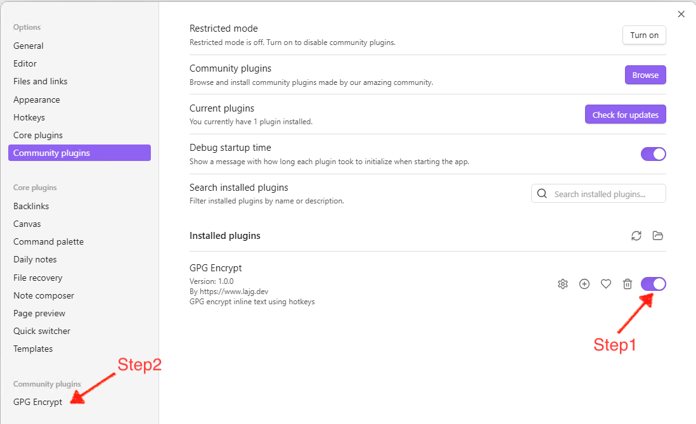
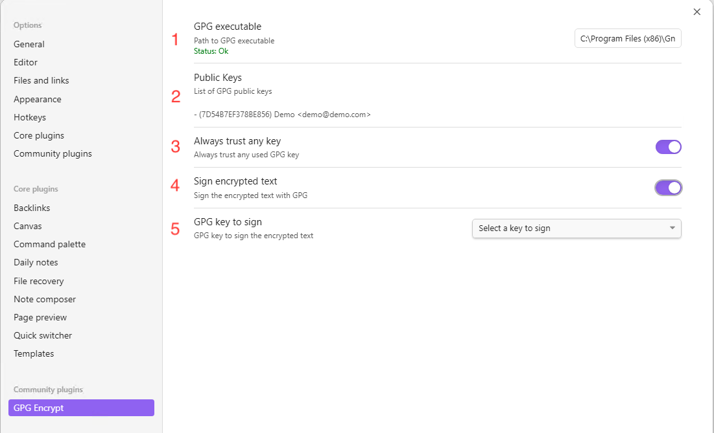
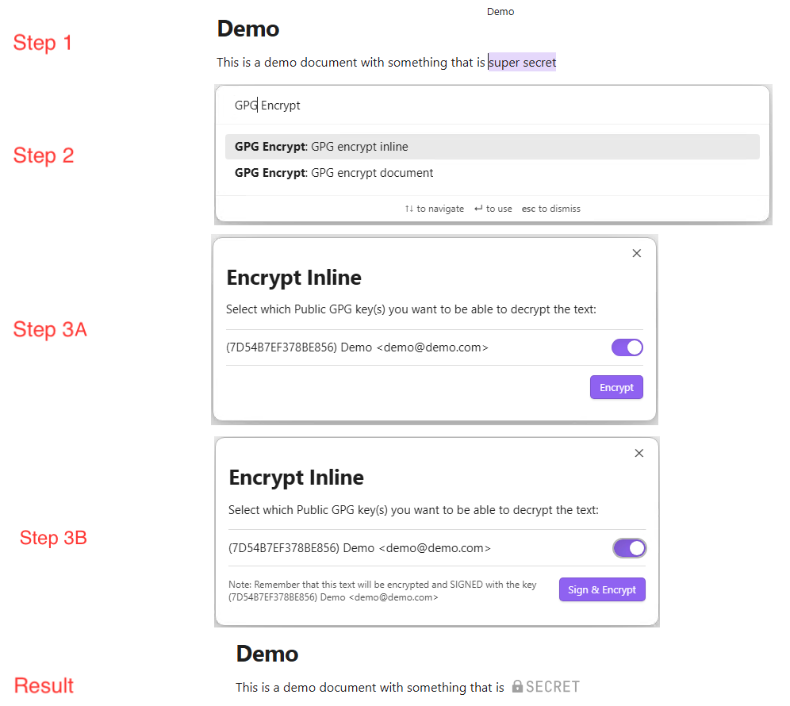
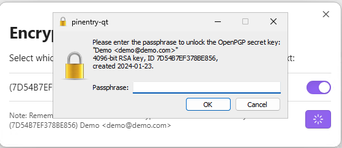
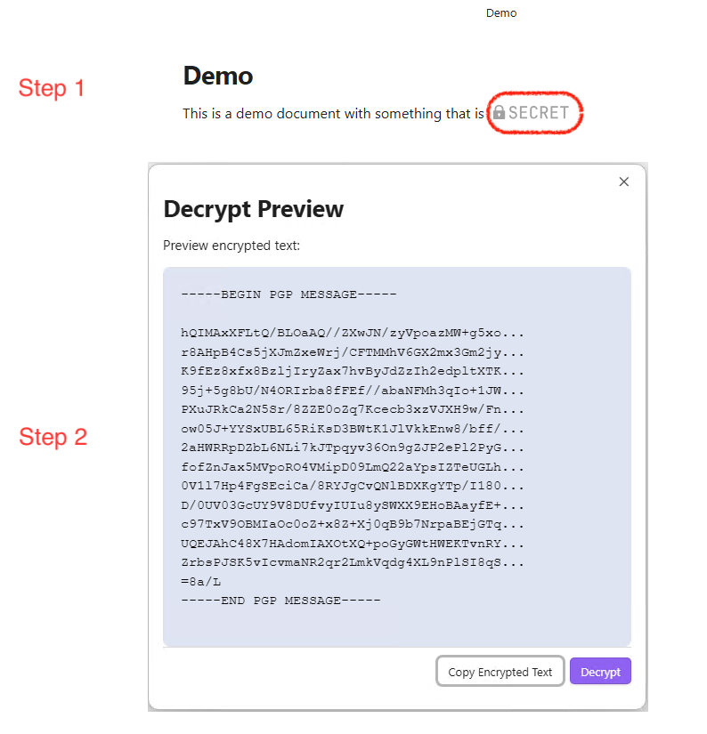
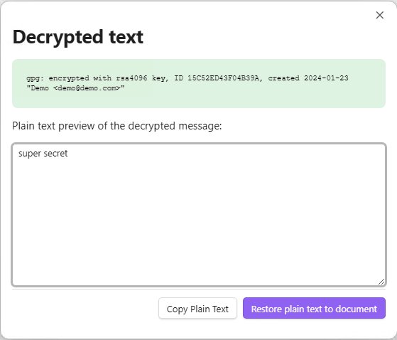

# GPG Encrypt

This project is developed by [https://www.lajg.dev](https://www.lajg.dev), it is an [Obsidian](https://obsidian.md) plugin that aims to perform encryption using the native tool of the GPG operating system, you can use online encryption or full document encryption.

## Funding URL

If you find this plugin helpful, please consider support it in [https://www.lajg.dev/donate/](https://www.lajg.dev/donate/)

## Configuration

The first thing to do is activate the plugin as shown in the image (Step 1), then go to the settings (Step 2):

Now in the settings you will find the following elements to configure:

1. Path where the executable is located (gpg, gpg2, gpg.exe or gpg2.exe), you must enter the full path, and depending on your OS it may be Windows (Example `C:\Program Files (x86)\GnuPG\bin\gpg.exe`) or it can be MacOS (Example `/usr/local/bin/gpg`). This will do a real-time validation that the executable exists and that it runs a version of GPG
2. Once a GPG executable has been chosen, a list of the GPG keys that were found in your Operating System will be listed (for information purposes).
3. Flag used to always trust the GPG keys that are stored in the Operating System regardless of their trust level per key.
4. Flag to mark if you want to sign the text when encrypting it
5. If you mark point 4 as true, point 5 will be activated with a drop-down list of the keys in your Operating System, you must select one with which it has its respective private key, this will mean that every time you go to encrypt a text, this will also be signed with that private key.

## Encrypt some text

Step 1 - In a note you have, select the text you want to encrypt (For inline encryption) and open the command palette
Step 2 - In the command palette, look for the "GPG Encrypt" option, here you will have the option to encrypt inline (The block of text that you selected in step 1) or to encrypt the entire document.
Step 3A - A pop-up window will appear with the list of GPG keys available in your Operating System, select one or more recipient keys that you can decrypt this text later (It is mandatory to select at least one)

Step 3B - If you select sign and encrypt, the only difference with Step 3A is that now the button will tell you that it is going to Sign and Encrypt, and this may prompt you for your phasphrase to sign the text.

## Decrypt some text

Step 1 - The first step is from a note with an encrypted secret, click (like a button) on the image that says secret
Step 2 - This will open a modal with the message encrypted in GPG, if you want to copy the encrypted message, you can do so using the "Copy Encrypted Text" button, you can also decrypt the message with the "Decrypt" button

Step 3 - By clicking on the "Decrypt" button, the decryption process will begin, this may prompt you for your phasphrase

Step 4 - Once the decryption process has finished, you will have a green message with technical information about the process, but you will also have a text area with the decrypted text, here you can copy it using the "Copy Plain Text" button or directly restore the decrypted text to the note using the "Restore plain text to document" button

